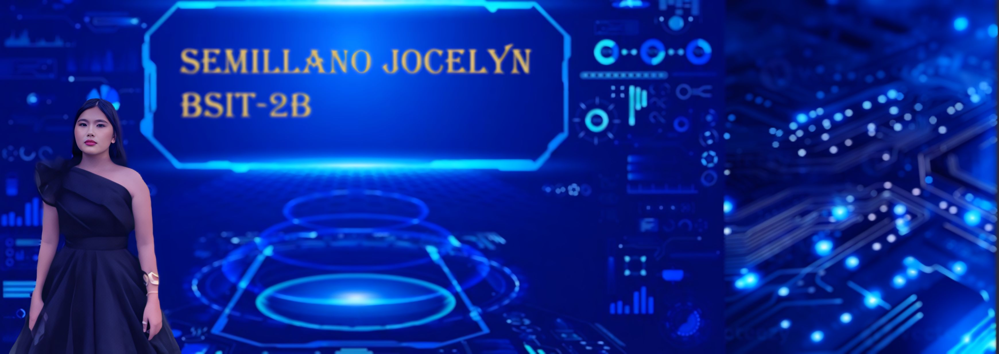
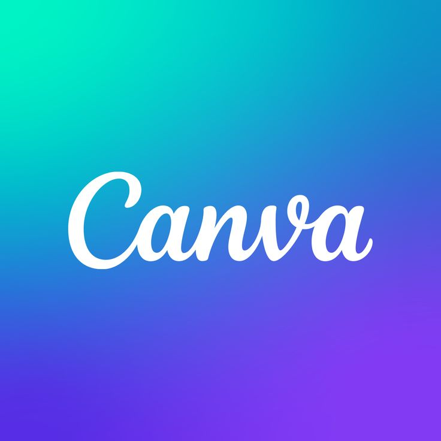

<!DOCTYPE html>
<html lang="en">
<head>
<meta charset="UTF-8" />
<meta name="viewport" content="width=device-width, initial-scale=1.0" />
<title>Jocelyn Semillano - Enchanted Portfolio</title>
<link href="https://fonts.googleapis.com/css2?family=Poppins:wght@300;400;600;700;800&display=swap" rel="stylesheet">

</head>

<body class="relative min-h-screen">

<!-- 🌙 NAV -->
<nav class="py-3 px-2 text-center text-white font-bold text-base sm:text-lg flex flex-wrap justify-center gap-4 sticky top-0 z-50 bg-pink-700/40 backdrop-blur-md">
  <a href="#home">Home</a>
  <a href="#about">About</a>
  <a href="#skills">Skills</a>
  <a href="#experience">Experience</a>
  <a href="#tutorials">Tutorials</a>
  <a href="#tools">Tools</a>
  <a href="#contact">Contact</a>
</nav>

<!-- 🏰 HOME -->
<section id="home" class="flex flex-col items-center text-center px-4 py-16 sm:py-20">
  <h1 class="text-3xl sm:text-5xl font-bold mb-6 glow-text">Welcome to My Enchanted Portfolio!</h1>
  

    
  

</section>

<!-- 📝 ABOUT -->
<section id="about" class="text-center px-4 py-12 sm:py-16">
  <h2 class="text-3xl sm:text-4xl font-bold mb-6 text-pink-400 glow-text">✨ About Me ✨</h2>
  

    
Hi, it’s me Celyn, a passionate 2nd Year BSIT Student. I love blending creativity and technology to create projects that feel alive and magical.

    
 My goal is to use technology to solve real-world problems and create meaningful digital experiences. I’m constantly learning new tools and improving my skills in programming, web development, and creative design software.

  

</section>

<!-- 🛠️ SKILLS -->
<section id="skills" class="text-center px-4 py-12 sm:py-16">
  <h2 class="text-3xl sm:text-4xl font-bold mb-8 text-pink-400 glow-text">🛠️ My Skills</h2>
  

    
    
    
    
    
  

</section>

<!-- 🏆 EXPERIENCE -->
<section id="experience" class="text-center px-4 py-12 sm:py-16">
  <h2 class="text-3xl sm:text-4xl font-bold mb-8 text-pink-400 glow-text animate-bounce">🏆 My Experience</h2>
  

    <!-- 🎬 PNP Anniversary Contest -->
    

      <h3 class="text-2xl font-semibold text-pink-300 glow-text mb-2">
        Champion in PNP Anniversary Video Editing Contest
      </h3>
      
🏅 Year: 2021

      

        Awarded for outstanding creativity and editing skills using 
        Film Maker Pro and 
        Kinemaster.
      

      

        
        
      

    

    <!-- 🎨 Tarpapel Editor -->
    

      <h3 class="text-2xl font-semibold text-pink-300 glow-text mb-2">
        Tarpapel Editor in Birthdays
      </h3>
      
🎨 Year: 2020

      

        Designed creative and personalized tarpapel layouts using 
        Canva.
      

      

        
      

    

  

</section>

<!-- 🌸 TUTORIALS -->
<section id="tutorials" class="text-center px-4 py-12 sm:py-16">
  <h2 class="text-3xl sm:text-5xl font-extrabold mb-10 text-pink-300 glow-text animate-bounce">✨ YouTube Tutorials ✨</h2>
  

    <iframe class="rounded-2xl w-full h-56 sm:h-64 glow-border" src="https://www.youtube.com/embed/wCEtWz5imUs" allowfullscreen></iframe>
    <iframe class="rounded-2xl w-full h-56 sm:h-64 glow-border" src="https://www.youtube.com/embed/ezldKx-jPag" allowfullscreen></iframe>
    <iframe class="rounded-2xl w-full h-56 sm:h-64 glow-border" src="https://www.youtube.com/embed/61mkx_OV61s" allowfullscreen></iframe>
    <iframe class="rounded-2xl w-full h-56 sm:h-64 glow-border" src="https://www.youtube.com/embed/keoszhf4DZ8" allowfullscreen></iframe>
  

</section>

<!-- 🧚 TOOLS -->
<section id="tools" class="text-center px-4 py-12 sm:py-16">
  <h2 class="text-3xl sm:text-4xl font-bold mb-8 text-pink-400 glow-text">🪄 Tools I Used</h2>
  

    
    
    
    
  

</section>

<!-- 💌 CONTACT -->
<section id="contact" class="text-center px-4 py-12 sm:py-16">
  <h2 class="text-3xl sm:text-4xl font-bold mb-8 text-pink-400 glow-text">💌 Let's Connect</h2>
  

    <form action="#" method="POST" class="space-y-4">
      

        <input type="text" placeholder="First Name" class="w-full px-4 py-2 border-2 border-pink-400 rounded-lg bg-transparent text-white placeholder-gray-300">
        <input type="text" placeholder="Last Name" class="w-full px-4 py-2 border-2 border-pink-400 rounded-lg bg-transparent text-white placeholder-gray-300">
      

      <input type="email" placeholder="you@example.com" class="w-full px-4 py-2 border-2 border-pink-400 rounded-lg bg-transparent text-white placeholder-gray-300">
      <textarea rows="5" placeholder="Your message..." class="w-full px-4 py-2 border-2 border-pink-400 rounded-lg bg-transparent text-white placeholder-gray-300"></textarea>
      <button type="submit" class="w-full py-3 px-4 bg-pink-600 text-white font-bold rounded-lg hover:bg-pink-700 transition glow-border">Send Message</button>
    </form>
  

</section>

</body>
</html>
